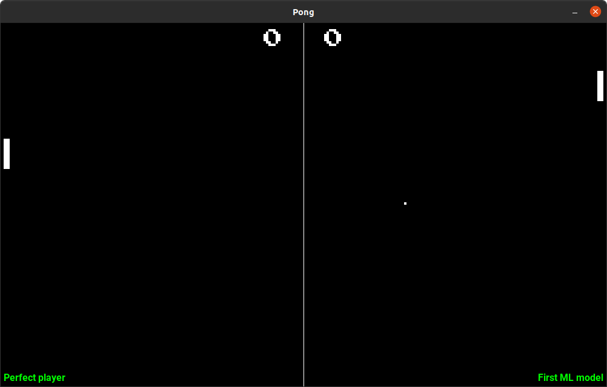
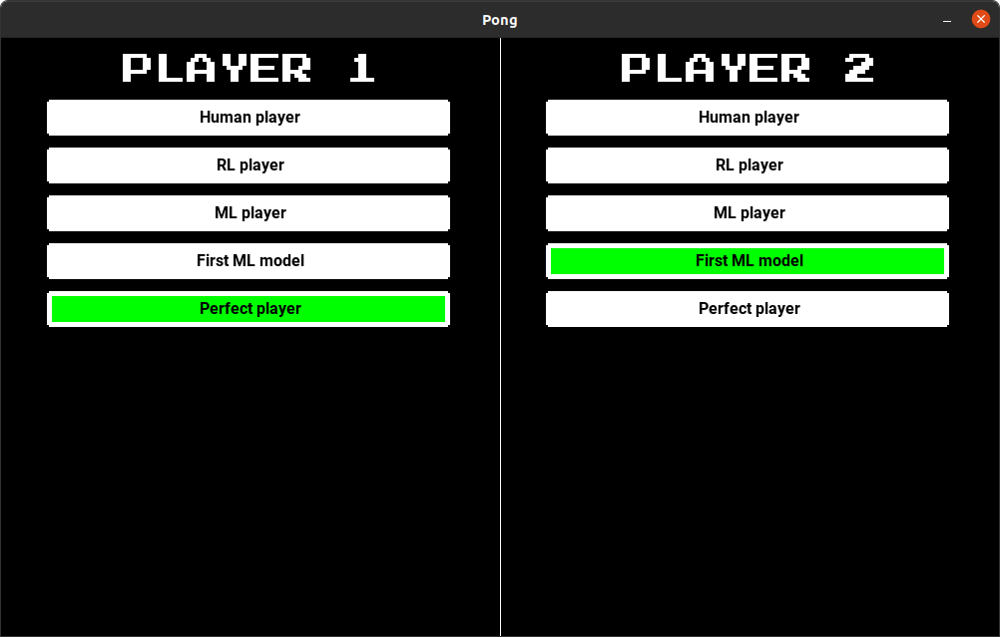

# Pong
## Introduction



A simple Python clone of the game "Pong". This is intended to be a simple test-stand for experimenting with different Machine Learning techniques.

## Installation 
Clone this repo, then make sure you have the following installed
* Python 3
* Pygame
* Tensorflow
* Keras
* CUDA

The main file is [run.py](run.py). This can simply be run with 
```
python run.py
```

## Usage
The first screen that opens lets you choose which player controllers to use for Player 1 and Player 2 respectively. Use the UP and DOWN arrows to change the current selection, use LEFT and RIGHT to select for Player 1 and Player 2 respectively.



Press ENTER to start the game.


## TL;DR
Here's a 30 second video summarising this project: [Link](https://youtu.be/59aGo8qErmw)
